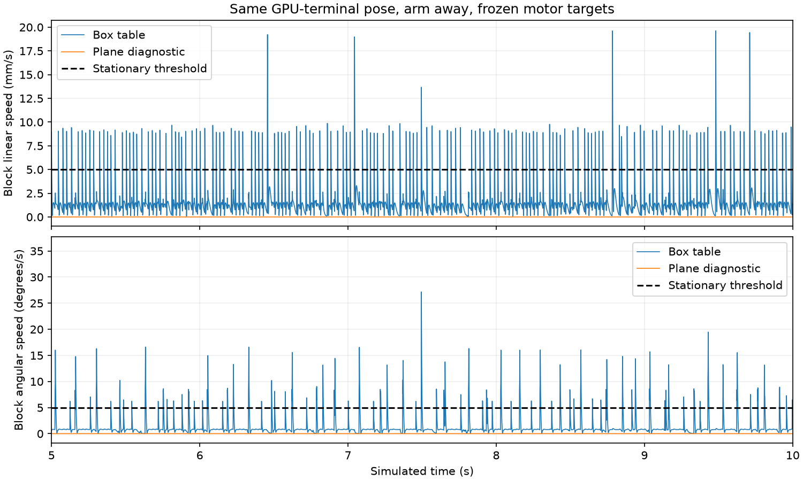

# GPU settling and numerical-instability isolation

**Checkpoint completed: the parking jitter is isolated to a GPU block/table contact case. Full-path numerical failures are not yet resolved. RL remains off.**

Production robot geometry, controller, scene physics and acceptance thresholds have not been changed. Plane-table and box-jaw variants exist only in diagnostic processes. No pushing attachment was added.

## Controlled evidence

Each GPU settling case uses three worlds with identical initial joint/object positions, zero velocities and solver warmstart, and frozen motor targets. It runs for 10 simulated seconds and records every 1 ms. Metrics below cover the final five seconds. The hold column checks only the existing velocity thresholds (5 mm/s and 5 degrees/s); it is not complete-task success. Initial poses are diagnostic resets, not a continuously executed solution.

| Pose / surface | Peak linear speed (mm/s) | Peak angular speed (deg/s) | Shortest of the three worlds' longest speed holds (s) |
|---|---:|---:|---:|
| Box: start_block | 0.000285 | 0.000000 | 5.000 |
| Box: park_block_arm_away | 0.000032 | 0.000010 | 5.000 |
| Box: park_block_gripper_present | 0.000032 | 0.000010 | 5.000 |
| Box: gpu_terminal_gripper_present | 19.745881 | 27.437599 | 0.042 |
| Box: gpu_terminal_arm_away | 19.642562 | 27.450875 | 0.039 |
| Plane: gpu_terminal_gripper_present | 0.000227 | 0.000000 | 5.000 |
| Plane: gpu_terminal_arm_away | 0.000230 | 0.000010 | 5.000 |

The start pose and native final parking pose settle cleanly on GPU. The GPU replay's final pose jitters with the gripper present **and with the arm away**. Native MuJoCo settles that same pose for five continuous seconds below the speed thresholds, both with and without the arm nearby. This rules out the IK controller and gripper contact as necessary causes of the reproduced resting jitter.

Changing only the diagnostic table collision shape from a finite box to a plane at the same top height eliminates that jitter in the tested cases. Mass, friction, contact solver settings, timestep and speed thresholds remain unchanged. This implicates the box/table contact calculation for this pose; it does not establish an upstream implementation defect or guarantee every pose is stable. A plane is infinite and must be restricted or accompanied by appropriate finite-workspace failure checks before production adoption.

## Moving sequence and nonfinite states

A shared PyTorch/Warp stream did not cure the full replay: the three-world control still included a nonfinite state at 8.5 seconds. Stream ordering alone is therefore not a sufficient fix. NVIDIA documents shared-stream interoperability here: [Warp PyTorch interoperability](https://nvidia.github.io/warp/latest/user_guide/interoperability/pytorch.html).

With explicitly identical qpos, qvel, motor targets, warmstart and initial site positions, a separate moving-controller diagnostic first exceeded a 1e-7 qpos difference between worlds at 0.9 seconds. Clearing warmstart every control interval did not remove that divergence. The initial disagreement is tiny and is not itself evidence of broken physics; it grows during this contact-sensitive fixed-command path.

A diagnostic that disables the detailed jaw collision meshes while retaining the jaw box collisions delayed that difference to 5.1 seconds. All three worlds stayed finite for 30 seconds with zero safety flags in that run. This changes contact geometry and was **not** a full-task success test. It is a candidate for geometry review, not permission to silently remove real gripper surfaces. The baseline moving-controller diagnostic also stayed finite in its recorded run; these tests do not prove that meshes alone cause the intermittent NaNs.

The moving-controller diagnostic bypasses episode termination to inspect numerical evolution and can continue after safety flags. It must not be used as an accepted physical path or task-success result. Parking-pose controller-only holds likewise start beyond the gate and can set shortcut flags; their purpose is settling isolation.

## Decision for the next checkpoint

1. Validate a numerically stable table-contact representation over multiple object orientations, with finite-table boundaries preserved.
2. Inspect jaw mesh/primitive contact overlap and trace the first nonfinite transition with contact forces and solver state; retain physically representative gripper geometry.
3. Repeat complete native/GPU paths and perturbation checks after any production fix. Then improve object-pose feedback and parking margin.

The resting-jitter reproducer and successful plane comparison are complete. The full-path NaN cause, a production contact fix, and RL readiness remain open. No success tolerance was relaxed.

## Reproduce one test group at a time

```powershell
.\scripts\isolate-gpu.ps1 -Mode settling
.\scripts\isolate-gpu.ps1 -Mode plane
.\scripts\isolate-gpu.ps1 -Mode native
.\scripts\isolate-gpu.ps1 -Mode controller
.\scripts\isolate-gpu.ps1 -Mode cold
.\scripts\isolate-gpu.ps1 -Mode jaws
.\scripts\isolate-gpu.ps1 -Mode report
.\scripts\isolate-gpu.ps1 -Mode view
```

Raw results and trajectories: `artifacts/isolation_*.json` and `.npz`. The manifest hashes current diagnostic code, input recordings and result files; exploratory reports retain the source hashes from their own run. Production source hashes are unchanged from the prior checkpoint. The GUI is a recorded settling test with the original box table, not a policy or live physics.


