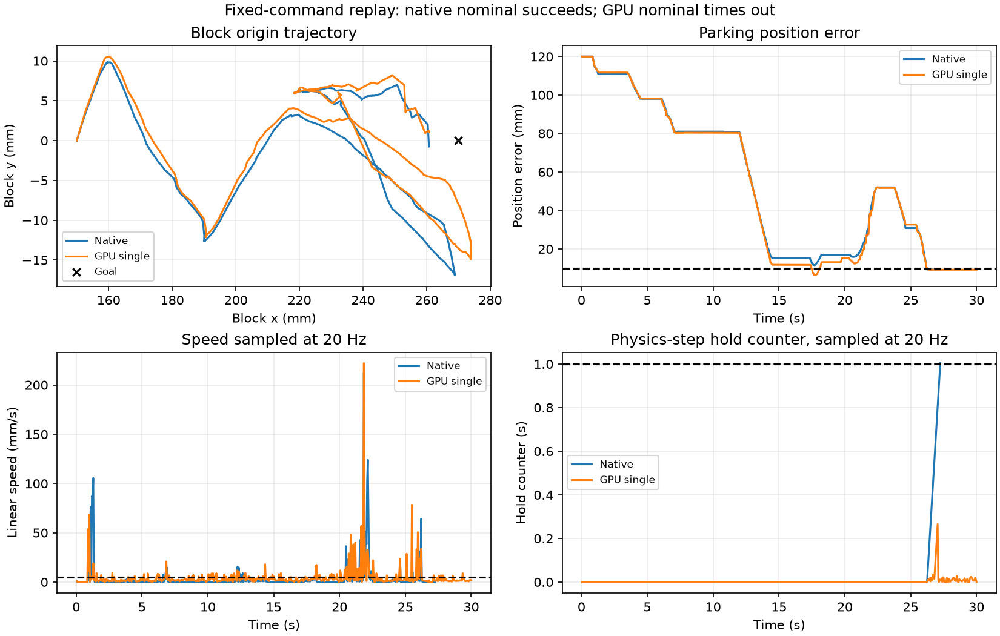

# Full-sequence GPU replay and sensitivity checkpoint

**Assessment: NOT READY for RL training. Tests completed; full-sequence GPU stability and replay robustness did not pass.**

The closed gripper and existing physics/controller/success tolerances were retained. No RL training was run.

## What was tested

The saved demonstration commands were replayed at 20 Hz for up to 30 seconds with the production controller and physics-step success/collision rules. The diagnostic wrapper retains terminal states for recording, then resets finished worlds while other worlds continue. It does not change success or failure calculations. Joint control uses feedback; the recorded task commands do not adapt to the object pose.

Thirteen cases per backend: nominal; initial x/y shifts of +/-1 mm; yaw shifts of +/-1 degree; sliding friction, block mass/inertia, and position actuator gain changes of +/-5%, one factor at a time. Friction scales the sliding coefficient on all geoms. Gain scales position stiffness, retaining damping. Native cases run separately; GPU cases run in one 13-world batch. Mass constants are recomputed for the batch containing mass perturbations. The single GPU and three-replica controls do not request this recomputation. Thus backend and batch/setup effects are not separated by this suite.

These are diagnostic cases, not 500 unseen trials, trained-policy evaluation, or a statistical success-rate estimate. Observation noise and control delay are not assessed here.

## Results

| Case | Native outcome (s) | GPU batch outcome (s) |
|---|---|---|
| nominal | success (27.25) | invalid_robot_contact (21.05) |
| x_minus | joint_limit (17.80) | joint_limit (13.65) |
| x_plus | timeout (30.00) | timeout (30.00) |
| y_minus | tipping_or_lifting (25.05) | nonfinite (14.60) |
| y_plus | timeout (30.00) | invalid_robot_contact (21.05) |
| yaw_minus | joint_limit (13.65) | timeout (30.00) |
| yaw_plus | invalid_robot_contact (21.05) | timeout (30.00) |
| friction_minus | joint_limit (13.65) | joint_limit (13.65) |
| friction_plus | joint_limit (17.90) | joint_limit (13.65) |
| mass_minus | joint_limit (13.65) | tipping_or_lifting (25.05) |
| mass_plus | joint_limit (13.65) | invalid_robot_contact (4.50) |
| gain_minus | joint_limit (13.65) | joint_limit (13.65) |
| gain_plus | invalid_robot_contact (21.00) | invalid_robot_contact (21.05) |

Native nominal: 9.316 mm and 7.049 degrees at 27.25 s.

Small perturbations completed: native 0/12; GPU batch 0/12.

Single-world GPU nominal: **timeout** at 30.00 s; final error 9.210 mm / 7.956 degrees. Gate passed: True. Failure flags: 0. Largest hold counter observed at the 20 Hz logging points: 0.265 s (required: 1 s). The actual acceptance monitor runs at every physics step. The sampled maximum is not an exact substep maximum.

Native half-timestep control (0.5 ms, same actions): **timeout**, 23.787 mm / 61.043 degrees at 30.00 s.

Three nominal GPU worlds, same prescribed initial pose, goals and commands:

- nominal_0: nonfinite at 7.30 s.
- nominal_1: success at 27.35 s.
- nominal_2: tipping_or_lifting at 25.05 s.

GPU outcomes also varied across exploratory reruns. Only the final source-matched suite is tabulated above; these figures should not be interpreted as deterministic per-case predictions. Nonfinite states occurred in GPU testing and remain an unresolved blocker. Floating-point/contact sensitivity, initialization, batching and solver behavior need controlled isolation; their individual causes have not been established.

## Interpretation and next checkpoint

The native nominal path remains a valid feasibility demonstration. Its final position margin is under 1 mm, and fixed-command replay is fragile to small perturbations and timestep changes. A feedback policy may recover from trajectory deviations, but that does not excuse numerical failures or unresolved resting-contact behavior.

Next: isolate GPU resting-block and identical-world consistency in short controlled tests, then retest the full path with object-pose feedback and more parking margin. Preserve collision rules and the one-second stationary requirement. No training-readiness approval was generated; long training remains blocked by the existing preflight.

## Reproduce and view

```powershell
.\scripts\replay-sensitivity.ps1 -Mode all
.\scripts\replay-sensitivity.ps1 -Mode view
```

The GUI displays recorded GPU states in the Windows MuJoCo viewer; it does not resimulate them or run a policy. P pauses/resumes and R restarts paused. The native successful recording remains available with `scripts/view-audit.ps1 -Trial full`.

Evidence: `artifacts/full_replay_*.json` and matching NPZ trajectories, `artifacts/full_replay_summary.json`, and the comparison plot below. Reports include input and source hashes. Nonfinite numerical metrics are JSON null; failed trajectories remain diagnostic evidence.


