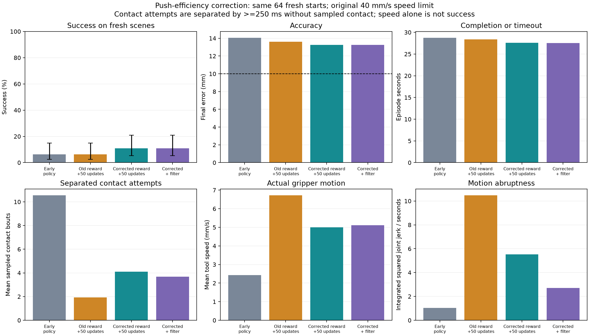

# Gripper push-efficiency correction

## Diagnosis

The watched policy requested only 5.32 mm/s average planar tool speed, and the actual gripper followed at 5.32 mm/s. The existing maximum is 40 mm/s. The slow behavior is predominantly a policy-command issue, not evidence that the actuator cannot track the request.

Native reconstruction of the saved 20 Hz poses detected jaw contact around 17.55 seconds in the 18.6-second example. At that contact pose, the old directional approach objective still measured a 35.82 mm error to its single stand-off target. The new jaw-contact approach cost is zero at that state. A stand-off objective remaining nonzero is not by itself proof of a reward bug, but it can compete with continuing an already useful contact.

Evidence: `artifacts/push_efficiency/command_diagnosis.json`. Contacts between saved frames can be missed, and native collision reconstruction is not a second live GPU rollout.

## Rejected shortcut

Simply multiplying the old policy's low commands was tested and rejected. A bounded nonlinear response retained zero command, the original maximum speed and acceleration limits. On the same 64 development starts, the watched policy scored 7/64; gain 2 and gain 4 both scored 0/64, with 6 and 35 rule failures respectively. Faster motion alone was worse. This action remapping is not used in the corrected training branch.

## Implemented reward experiment

`scripts/efficient_push.py` is an isolated stage-2 wrapper. It preserves the gripper, physics, controller, action mapping and independent success detector.

- Replace attraction toward one tool-site stand-off point with a geometric gap from the six actual Menagerie jaw-tip spheres to the two block boxes. Actual detected jaw/block contact makes the approach gap zero, including contact by other jaw geometry. Before contact, this is a jaw-tip approach proxy, not an exact distance between every collision surface.
- Increase useful goal-distance progress reward from 300 to 600 per meter.
- Increase elapsed-time cost from 0.01 to 0.02 per policy step.
- Charge 0.10 for a renewed contact after at least 250 ms of sampled separation, after the first contact. This does not reward idle contact.
- Add 0.04 times squared action change to the existing smoothness cost.
- Increase total rule-failure cost from 5 to 20, so early failure is not cheaper than the full episode's idle time cost of 12.

Stage 1 rewards are unchanged. The native parity check verifies unchanged dynamics and termination, corrected terminal return accounting, and added-state serialization. The 16-world GPU smoke check verifies finite rewards and simulation. An injected native rule failure verifies the failure reward. Evidence: `artifacts/push_efficiency/checks.json`.

## Bounded comparison

Both branches start from the early distance-curriculum actor and its observation normalization. Both receive a fresh critic and optimizer, fixed learning rate 0.0003, initial exploration standard deviation 0.10 and floor 0.05, and training seed 9420. They train for 50 updates each using 2,048 environments. The comparison therefore tests the reward bundle under matched initialization; it does not isolate each reward coefficient or compare identical optimization history to the previous learning-rate experiment.

The old-reward control completed and was preserved. A candidate initialization was interrupted before its first completed update to add the stronger failure penalty; its metadata is archived under `runs/push_efficiency/efficient_preflight_interrupted`. The completed control was reused, not retrained.

Development and fresh panels use seeds 6,500,000 and 6,600,000, respectively, with 64 episodes each. Each policy sees identical initial states within a panel. The final milestone test set remains untouched. Evaluation uses the original action mapping and independent task rules. Per-episode return values in the evaluation JSON are from the evaluation wrapper's directional reward, not the new training reward, and are not used to compare policies.

Contact bouts are defined using actual jaw/block flags sampled at 20 Hz, separated by at least 250 ms without sampled contact. This is a proxy for separate push attempts, not a count of every solver contact or every 50 ms control update. Fewer contact bouts count as improvement only alongside accurate, successful movement.

## Results

The correction improves the familiar demonstration and the small set of matched successful fresh episodes, but it does not make stage 2 reliable. The saved playback candidate is `runs/push_efficiency/efficient/filtered.pt`. Keep all earlier checkpoints; this is an experimental stage-2 improvement, not milestone completion.

| Policy | Development successes / 64 | Fresh successes / 64 |
|---|---:|---:|
| Early policy used for initialization | not measured in this panel | 4 |
| Old reward, matched 50-update control | 11 | 4 |
| Corrected reward, 50 updates | 13 | 7 |
| Corrected reward plus mild command filter | 12 | 7 |

These small success differences do not establish a reliable learning improvement across seeds. Fresh success for the selected configuration is only **10.9% (7/64)**, with Wilson 95% interval 5.4-20.9%; 57 episodes time out. No rule or numerical failures were detected in either 64-episode panel for the selected mild filter. The policy has not advanced beyond 15-20 mm targets.

### Faster and fewer attempts on matched successes

All four fresh scenes solved by the early policy were also solved by the selected policy:

| Mean on those same four scenes | Early | Corrected + mild filter |
|---|---:|---:|
| Completion time | 10.23 s | 6.74 s |
| Sampled contact bouts | 2.25 | 1.25 |
| Final position error | 9.60 mm | 8.49 mm |
| Duration-normalized squared joint jerk | 3.36 | 14.90 |

The observed motion is faster, with fewer contact attempts and better final position accuracy on these four successes, but it is more abrupt than the very slow early policy. This is a small, success-conditioned comparison and cannot be generalized to all starts. Against the matched old-reward retraining control, the correction gains three fresh successes and reduces jerk, but is slower and uses slightly more contacts on their four common successes. The reward change is therefore a tradeoff, not an across-the-board win.

### Command smoothing

The selected filter uses `applied_command = previous_applied_command + 0.5 * (clipped_policy_command - previous_applied_command)`. It retains zero-command stopping, the 40 mm/s speed cap and 200 mm/s-squared acceleration cap. It is a controller calibration applied after training; the actor was not trained with the filter enabled. Its alpha is stored in `filtered.pt` and is applied by the recorder. Raw and applied commands are both saved in the recording.

On fresh scenes, the filter retained exactly the same seven successful episodes, reduced mean duration-normalized jerk from 5.52 to 2.72, and reduced their mean contact bouts from 2.57 to 1.43. A stronger filter (alpha 0.25) caused a development rule failure and was rejected. A native parity test verifies that the playback wrapper implements the same filtered dynamics as the evaluator, including reset behavior.



### Visible replay

The unchanged demonstration seed 3,000,000 succeeded in **7.30 s**, versus **18.60 s** in the previously watched fixed-rate policy. Final error was **9.59 mm**, versus **9.96 mm**. Integrated squared joint jerk was 18.67 versus 73.38; normalized by episode duration, it was 2.56 versus 3.95. This single successful demonstration is not representative of the low aggregate success rate.

The Windows MuJoCo GUI was launched using:

```powershell
Set-Location D:\Sim2Real2Sim
.\scripts\watch-policy.ps1 -Checkpoint runs/push_efficiency/efficient/filtered.pt -Stage 2 -Seed 3000000
```

Use the window labelled `PPO efficient/filtered`. It replays recorded learned-policy physics states. P pauses/resumes and R returns to the start. The gate remains absent because this is stage 2.

The original source, physics and earlier policies are preserved. The selected filter is an explicit experimental configuration, not silently added to other policies. Do not resume this filtered checkpoint through a trainer that omits the filter; a subsequent training run must apply it consistently during collection and evaluation.

The remaining issue is reliability over varied starting positions. The present results do not support an overnight run or a claim that the slow-pushing problem is fully solved across scenes. A next bounded run should train with the selected filter included, retain the corrected gripper reward, and track failures to turn initial contact into useful displacement.
