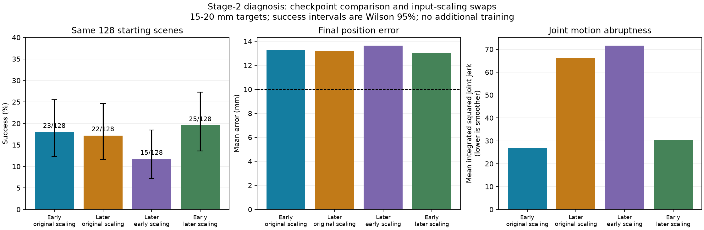

# Stage-2 checkpoint diagnosis — 2026-10-05

The apparent large success decline was not reproduced on identical starting scenes. The later policy remains poor at pushing, and its joint motion is less smooth. The next experiment should address update stability and measure progress on a fixed comparison panel before extending training.

## Completed evidence

Four read-only evaluations used exactly the same 128 development scenes, at 15–20 mm target distances. Initial joint/object states and goals have matching hashes across all four runs. The actual gripper, physics, controller, rewards, and success detector were unchanged. These are not final milestone test scenes.

| Policy weights | Observation scaling | Success | Mean final error | Mean integrated squared joint jerk |
|---|---|---:|---:|---:|
| Early, update 25 | Early | 23/128 (18.0%) | 13.25 mm | 26.78 |
| Later, update 100 | Later | 22/128 (17.2%) | 13.19 mm | 66.09 |
| Later | Early | 15/128 (11.7%) | 13.64 mm | 71.59 |
| Early | Later | 25/128 (19.5%) | 13.03 mm | 30.43 |

All four evaluations had zero rule failures and no detected numerical failures. The jerk metric integrates the mean squared jerk of the five arm joints over each episode; lower is smoother. It is not peak tool jerk.



The original policies succeeded together in 16 scenes; 7 favored the early policy and 6 favored the later policy. That does not establish a meaningful success regression. Earlier training validations used different 64-scene samples, and the early checkpoint was selected for the highest observed score. Sampling and selection therefore confounded the apparent 28.1% to 12.5% decline. The paired test does not prove identical policies or exclude smaller differences.

The early checkpoint previously scored 22/128 on this development seed and now scores 23/128. Repeated GPU contact rollouts are not guaranteed bit-identical near the success threshold; one episode's difference should not be overinterpreted.

## What is going wrong

1. **Insufficient pushing remains the main observed failure.** Both original policies reduce goal distance by only about 4.3 mm on average, finishing around 13.2 mm away against a 10 mm tolerance. At the 20 Hz diagnostic samples, the number of episodes entering the position tolerance equals the number succeeding: 23 early, 22 later. This points toward insufficient displacement, rather than widespread failure to hold after arriving. Sub-step transient entries were not counted.
2. **Later motion is rougher without useful progress.** Joint jerk increases by 2.47 times, while final position error is almost unchanged. Average summed action magnitude also increases. Neither original policy clips an action component in these deterministic evaluations. The existing smoothness reward penalizes action changes and joint velocity; it does not directly penalize the reported jerk metric.
3. **Input-scaling drift is not a demonstrated cause.** Swapping early scaling into the later network worsens success in this panel. The increased jerk follows the later network weights across both scaling choices. The slightly higher result for early weights with later scaling is not enough evidence to deploy that hybrid.
4. **Exploration did not collapse during this pilot.** Saved action standard deviations increase from [0.0531, 0.0527] to [0.0649, 0.0575]. This does not establish that exploration is adequate, only that a further collapse is not the explanation here.
5. **Adaptive PPO updates can be aggressive.** Although the configured initial learning rate is 0.0003, the early and late saved optimizer rates are 0.004379 and 0.002919. Installed PPO code can raise the rate as high as 0.01 and adjusts it inside the minibatch loop. A large update can occur before the subsequent KL measurement reduces the rate.

## Disposable PPO update comparison

Starting from the early checkpoint, the diagnostic collected one 32-step rollout across 2,048 environments. Two independent copies of the same actor, critic, optimizer, and 65,536-transition buffer received one PPO update, with identical minibatch random seeds. One used the inherited adaptive schedule; the other used a fixed 0.0003 rate. Both updated models were discarded; no policy checkpoint was replaced.

| Measurement on the rollout after the update | Inherited adaptive | Fixed 0.0003 |
|---|---:|---:|
| Mean policy KL divergence | 0.01009 | 0.00447 |
| Fraction outside PPO's 0.8–1.2 likelihood-ratio interval | 13.55% | 4.03% |
| Mean action-mean displacement | 0.00668 | 0.00423 |

This supports testing smaller updates: they change the policy less on identical data. It does **not** prove that the learning rate caused the historical smoothness regression or that a smaller rate will improve task success. That requires a bounded training comparison. Loss logs alone do not establish a critic failure; historical minibatch KL and learning-rate histories were not logged and cannot be reconstructed from two checkpoints.

The diagnostic's `contact_steps` field uses the inherited tool-site distance proxy, not actual jaw contact. Its zero values must not be interpreted as absence of physical contact. Future contact-retention diagnostics should use actual jaw/block contact flags.

## Recommended next bounded experiment

Start independent branches from the early checkpoint, preserving all existing files. Compare the inherited schedule against fixed 0.0003 for 25 updates each, keeping the same goals, rewards, controller, exploration floor and optimizer history. Evaluate both on the same fixed development panel before and after, plus a separate fresh validation panel. Log learning rate, KL, clip fraction, actual jaw contact, useful block displacement and jerk. Keep the existing independent promotion requirement; do not advance based solely on the reused diagnostic panel.

This experiment is proposed, not executed here. A lower rate may preserve behavior without teaching stronger pushes. If success still stalls, inspect contact retention and the reward for continuing a push before changing more parameters. No overnight run is recommended.

## Reproduce

From PowerShell in `D:\Sim2Real2Sim`:

```powershell
wsl -d Ubuntu-22.04 -- /home/$env:USERNAME/.venvs/so101-m1/bin/python -u scripts/diagnose_distance_decline.py
wsl -d Ubuntu-22.04 -- /home/$env:USERNAME/.venvs/so101-m1/bin/python -u scripts/audit_ppo_update.py
wsl -d Ubuntu-22.04 -- /home/$env:USERNAME/.venvs/so101-m1/bin/python scripts/plot_stage2_decline.py
```

Evidence is in `artifacts/stage2_decline/`: per-episode JSON files, `comparison.json`, `paired.json`, `ppo_update.json`, and the graph. Diagnostic scripts overwrite those diagnostic outputs when rerun; training checkpoints remain untouched. Physics preflight and curriculum source compatibility were rechecked after diagnosis.
