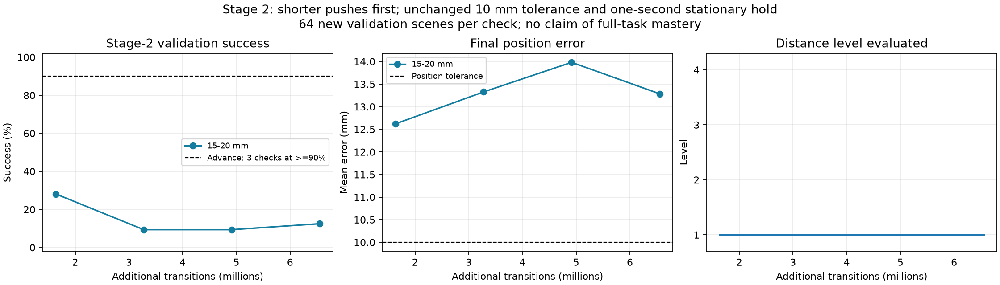

> Follow-up diagnosis: the apparent success decline was not reproduced on matched scenes; later motion is rougher. See [STAGE2_DECLINE_DIAGNOSIS.md](STAGE2_DECLINE_DIAGNOSIS.md) before interpreting the validation curve below.

# Stage 2: learn short pushes before longer pushes

This is a training curriculum for the existing PPO policy. It changes the initial target distance in stage 2. It keeps the gripper, physics, controller, observations, directional reward, 30-second episode limit, and success rule unchanged.

| Level shown here | Initial block-to-target distance |
|---|---|
| 1 | 15–20 mm |
| 2 | 20–25 mm |
| 3 | 25–30 mm |
| 4 | Original reset distribution: 30–40 mm forward offset, with up to 12.5 mm sideways offset |

The last level restores the original distribution exactly; its straight-line distance can exceed 40 mm because of the sideways offset. Shorter levels preserve the sampled direction and scale the distance.

The success tolerance remains **10 mm**, with an upright block moving at no more than 5 mm/s for **one continuous second**. Therefore the easiest level still requires at least about 5–10 mm of useful block displacement. Zero-action tests confirm it cannot pass simply by waiting. Stage 2 does not require orientation alignment; that remains a later skill.

## Advancement and checkpoints

- Validate every 25 PPO updates on 64 new, reproducibly seeded stage-2 scenes at the current distance level.
- Advance only after **three consecutive checks at or above 90% success**. A failed check resets the streak.
- Keep 20% stage-1 resets. At later distance levels, 20% of stage-2 resets use earlier distances; the remainder use the current distance.
- Report training outcomes separately by distance level. Mixed easier episodes never count toward the promotion gate.
- Save the distance level, passing streak, per-world level, initial target distance, policy, critic, optimizer, normalization, environment state and random generators.
- Stop after the final distance level passes its gate. This completes the stage-2 curriculum only; it does not claim mastery of rotation, gate passage or the full task.

The new trainer uses a separate checkpoint signature. Its checkpoints must be resumed with the curriculum entry point, not the original `run.ps1 train` command. Original runs are preserved.

## Checks completed

`scripts/check_distance_curriculum.py` checks promotion and streak reset, final-level completion, goal distances, goal-marker agreement, state restoration, GPU subset resets, easier-level mixing and zero-action rejection on native MuJoCo and GPU simulation. Evidence: `artifacts/stage2_distance/checks.json`.

A 16-world PPO smoke run and resume continued from update 2 to 4 and from 1,024 to 2,048 transitions, preserving curriculum state and continuing optimizer updates. Evidence: `artifacts/stage2_distance/resume_check.json`.

The pilot initializes from `runs/stage2_directional_audit/latest.pt`, retaining the actor, critic and optimizer while creating fresh short-distance episodes. Its initial launch was interrupted before validation completed; the initial checkpoint was preserved and resumed. Completed pilot evidence is recorded in `runs/stage2_distance_seed73`.

## Commands in VS Code PowerShell

Continue the existing pilot for up to 100 more PPO updates or 30 minutes, whichever comes first:

```powershell
Set-Location D:\Sim2Real2Sim
.\scripts\train-stage2-curriculum.ps1 -Resume runs/stage2_distance_seed73/latest.pt -Updates 100 -Hours 0.5
```

This does not restart from scratch. The command is intentionally bounded; it does not launch an overnight job. Ctrl+C requests stopping at an update boundary. `latest.pt` is also saved at validation boundaries. Do not edit the curriculum source files between save and resume; the source-signature check rejects incompatible resumes.

Inspect the best checkpoint for the first distance level in the Windows MuJoCo GUI:

```powershell
.\scripts\watch-policy.ps1 -Checkpoint runs/stage2_distance_seed73/best_level0.pt -Stage 2
```

The recorder reads the checkpoint's distance level and reproduces the corresponding target distribution. The GUI replays physically executed policy states. P pauses/resumes; R returns to the start. The gate is absent because this is stage 2.

For the latest policy and its current distance level:

```powershell
.\scripts\watch-policy.ps1 -Checkpoint runs/stage2_distance_seed73/latest.pt -Stage 2
```

Learning dashboard:

```powershell
.\scripts\tensorboard.ps1
```

Open <http://localhost:6006> and select `stage2_distance_seed73`. Validation series are separated by distance level. These short-distance success rates must not be presented as success on the original full puzzle.

## Completed bounded pilot (2026-10-05)

The 2,048-world pilot completed 100 PPO updates (6,553,600 additional environment transitions) in approximately six minutes. The first interrupted launch was recovered from its initial checkpoint. No distance promotion occurred.

| Update | Success on 64 fresh validation scenes | Mean final position error | Rule failures |
|---|---:|---:|---:|
| 25 | 18/64 (28.1%) | 12.62 mm | 0 |
| 50 | 6/64 (9.4%) | 13.33 mm | 0 |
| 75 | 6/64 (9.4%) | 13.98 mm | 0 |
| 100 | 8/64 (12.5%) | 13.29 mm | 0 |

All checks used 15-20 mm initial target distances. These are different validation samples, so variation combines policy changes and scene sampling. The highest-scoring checkpoint is update 25 (`best_level0.pt`); `latest.pt` is update 100. The results do not establish reliable learning or justify an overnight run yet. Stage-1 retention also deteriorated in training logs and requires attention before advancing beyond this pilot.

The original policy checkpoint, production environment and training sources remain unchanged; the existing physics preflight passes. Evidence: `artifacts/stage2_distance/integrity.json`.



This checkpoint implements and verifies the distance curriculum, not a mastered pushing policy. Further learning diagnosis should examine contact retention and why performance declines after the early checkpoint before committing to a long run.

### Separate evaluation of the best checkpoint

On 128 separate development scenes (seed 5,300,000), the best saved short-distance policy achieved **22/128 successes (17.2%)**, with a Wilson 95% interval of 11.6-24.7%. Mean final position error was **13.27 mm**; 106 episodes timed out and none triggered a rule failure. This is below the advancement requirement. These scenes are not the final milestone test set. Evidence: `artifacts/stage2_distance/evaluation.json`.

Reproduce this evaluation from PowerShell:

```powershell
wsl -d Ubuntu-22.04 -- /home/$env:USERNAME/.venvs/so101-m1/bin/python scripts/evaluate_distance_curriculum.py runs/stage2_distance_seed73/best_level0.pt
```

Use this evaluator for curriculum checkpoints: it reads the saved distance level. The original evaluation entry point uses the original task distribution and is not equivalent.

### GUI verification

The PowerShell playback command was executed successfully and the native viewer reported `GUI READY`. The unchanged demonstration seed 3,000,000 succeeded after 14.7 seconds with 9.93 mm final error, from a 16.22 mm initial target distance. This single example is not representative of the aggregate 17.2% success rate. The GUI shows a recorded learned-policy rollout, with the actual gripper and the saved short-distance goal; it is not live policy inference. The block only needs a small displacement in this first distance level. Recording: `artifacts/stage2_distance_seed73/best_level0_stage2_seed3000000.npz`; still image: `artifacts/stage2_distance/playback.png`.
