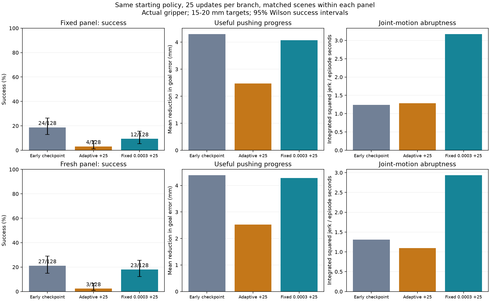
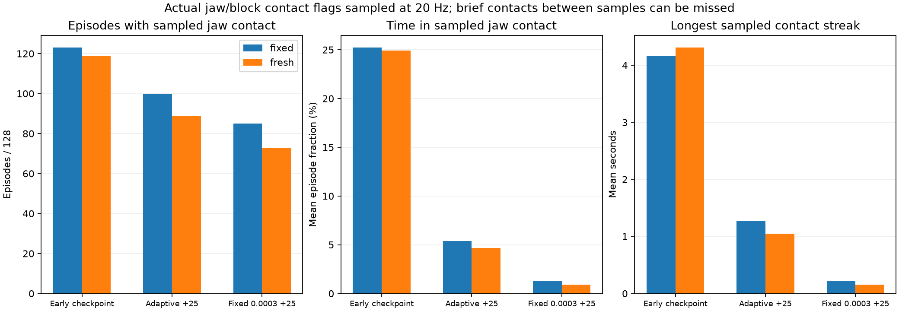
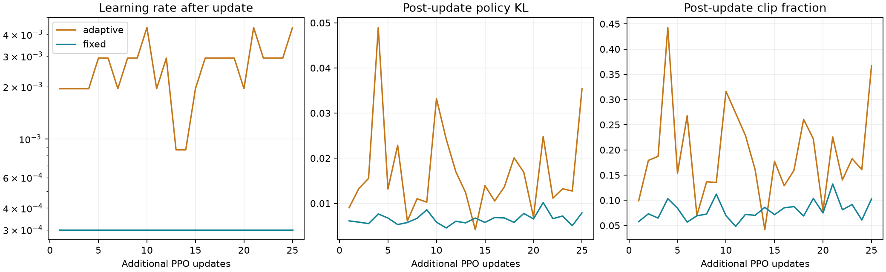

# Stage-2 learning-rate comparison — 2026-10-05

## Experiment

Two independent branches start from `runs/stage2_distance_seed73/best_level0.pt` (source update 25). Each performs exactly **25 additional PPO updates**, with **2,048 environments**, **32 control steps per rollout**, and **1,638,400 additional transitions**. The branches preserve the source actor, critic, optimizer moments, observation normalization, physics state, task state and random generators.

- **Adaptive:** retain the inherited PPO adaptive schedule and optimizer learning rate.
- **Fixed:** set the learning rate to **0.0003** after loading the optimizer and use a fixed schedule.

Both retain the existing 15–20 mm distance level, rewards, action limits, smoothness penalties, exploration floor and easier-stage training resets. No curriculum promotion occurs during this diagnostic. Initial branch simulator-state hashes are recorded. Policies collect their own trajectories once their actions diverge; matching initial random states does not imply identical later training experience.

## Evaluation protocol

Evaluate the early checkpoint and both final branch checkpoints on:

1. A **fixed development panel**: 128 episodes, seed 5,300,000, already used for earlier diagnosis.
2. A **fresh development panel**: 128 episodes, seed 6,400,000, specified before this comparison.

Each panel uses two batches of 64 worlds, exactly one episode per world. The same initial joint states, block states and goals must have identical hashes across the three policies. These panels are not the final milestone test set. The fixed panel may be useful for comparison but is not an unbiased final test after repeated tuning.

Success uses the existing independent detector: within 10 mm, upright and nearly stationary for one continuous second. A final orientation match and gate passage are not required at stage 2.

Measurements include success and failures, final error, reduction in goal error, displacement along the initial goal direction, actual jaw/block contact, and joint jerk. Contact comes from the existing collision monitor's allowed jaw/block pairs with nonpositive separation. It is sampled at **20 Hz**, captured before episode reset; reported contact seconds and longest streak are sampled estimates, not exact 1 ms physics contact durations. Brief contacts between samples can be missed. Native parity tests verify that the observer does not change physics, rewards or termination, including a terminal reset.

The jerk metric integrates mean squared jerk across the five arm joints. Both raw episode totals and totals divided by episode duration are reported, so shorter successful episodes do not automatically appear smoother merely because they end earlier.

PPO diagnostics log learning rate, post-update mean KL, likelihood-ratio clip fraction and sampled contact fraction. Random generators are restored after the extra policy-distribution measurement so its sampling does not alter subsequent training noise.

## Files and commands

Final branch checkpoints are `runs/stage2_lr_comparison/adaptive/final.pt` and `runs/stage2_lr_comparison/fixed/final.pt`. They are experimental forks; they do not replace the earlier policies. Do not pass these files to the original curriculum resume command, which does not validate this experimental fork's signature.

Run the bounded comparison or regenerate its report from VS Code PowerShell:

```powershell
Set-Location D:\Sim2Real2Sim
.\scripts\compare-stage2-lr.ps1
```

Completed branches and matching saved evaluation files are reused. An incomplete branch causes an error for inspection, not an automatic restart or silent overwrite. This entry point cannot launch an overnight run.

View the learned policies in the native MuJoCo GUI on the same demonstration seed:

```powershell
.\scripts\watch-policy.ps1 -Checkpoint runs/stage2_lr_comparison/adaptive/final.pt -Stage 2 -Seed 3000000
.\scripts\watch-policy.ps1 -Checkpoint runs/stage2_lr_comparison/fixed/final.pt -Stage 2 -Seed 3000000
```

These windows replay recorded GPU policy trajectories, not a scripted solution or live inference. A single displayed episode is not the aggregate evaluation result.

Results and individual episodes are stored in `artifacts/stage2_lr_comparison/`; update logs, training episode records, experiment metadata and checkpoints are under the two branch run folders. Original physics evidence and checkpoints remain preserved.

## Results

Both branches completed all 25 updates, taking about 150 seconds each. The learning-rate change helped relative to the adaptive branch, but neither branch improved the starting policy. Keep the early checkpoint as the reference; do not extend either branch overnight.

| Policy | Fixed panel success | Fresh panel success | Fixed / fresh final error |
|---|---:|---:|---:|
| Early checkpoint | 24/128 (18.8%) | 27/128 (21.1%) | 13.25 / 13.13 mm |
| Adaptive +25 updates | 4/128 (3.1%) | 3/128 (2.3%) | 15.08 / 15.00 mm |
| Fixed 0.0003 +25 updates | 12/128 (9.4%) | 23/128 (18.0%) | 13.48 / 13.24 mm |

All 768 evaluation episodes had zero rule failures and no detected numerical failures. Training was not failure-free: the stochastic adaptive branch logged 14 stage-2 rule failures; the fixed branch logged 12 stage-1 rule failures. Neither branch recorded a stage-1 success in its mixed training episodes. These training counts are diagnostic and are not held-out evaluation rates.

The fixed-rate advantage over adaptive was 6.25 percentage points on the fixed panel (paired bootstrap 95% interval 1.56 to 10.94) and 15.63 points on the fresh panel (9.38 to 21.88). These intervals describe scene sampling for these trained policies. Only one pair of training runs was performed; the intervals do not measure variability across training seeds or establish a universally best learning rate.

The baseline previously scored 22 or 23 successes on the fixed development seed and now scored 24. Repeated GPU contact rollouts can differ near the success boundary. Initial scene hashes match, but bit-identical trajectories are not guaranteed; small count differences should not be overstated. The large adaptive drop in this new comparison is present on both matched panels.



### Contact, useful pushing and smoothness

| Fresh-panel measurement | Early | Adaptive | Fixed 0.0003 |
|---|---:|---:|---:|
| Mean reduction in goal error | 4.39 mm | 2.52 mm | 4.28 mm |
| Mean sampled jaw-contact time | 7.27 s | 1.36 s | 0.26 s |
| Mean longest sampled contact streak | 4.31 s | 1.05 s | 0.16 s |
| Mean integrated squared joint jerk | 24.95 | 25.87 | 60.34 |
| Mean squared joint jerk, normalized by episode duration | 1.31 | 1.10 | 2.94 |

The fixed branch largely preserved average pushing progress on fresh scenes but had about 2.24 times the baseline duration-normalized jerk and much shorter sampled contacts. It did not learn a stronger smooth push. The adaptive branch lost useful progress and success. Fewer contacts are not inherently bad: successful pushes may release the block. These outcomes give no evidence of improved task mastery. Contact measurements are sampled estimates and may miss brief impacts.



### PPO update behavior

Across 25 updates, mean post-update KL was 0.01683 for adaptive and 0.00654 for fixed. Mean likelihood-ratio clip fraction was 19.19% versus 8.01%. The adaptive learning rate after updates ranged from 0.000865 to 0.004379; fixed remained 0.0003. Thus smaller updates were achieved, but smaller updates alone did not produce a better pushing policy.



### Decision and next checkpoint

Do not replace the early checkpoint or begin an overnight run. The completed comparison supports avoiding the current aggressive adaptive schedule for the next diagnostic, but does not validate fixed 0.0003 as the final training configuration.

Next, audit whether the gripper-specific approach reward and planar controller favor making and maintaining useful pushing contact. Compare short recorded action sequences that continue a push, release, and stall from the same contact state; measure actual displacement, reward components, contact and motion penalties. Check the approach target against actual jaw geometry rather than the old tool-site distance proxy. This is a proposed diagnostic, not a proven reward defect. Use it to choose a focused correction before another bounded training comparison.

The PowerShell comparison wrapper was executed successfully after completion: it reused the saved branches/evaluations and regenerated the graphs without additional training. Production physics preflight and the original curriculum source signature still pass; evidence is in `integrity.json`.

The fixed-branch GUI command was verified (`GUI READY`). Its unchanged demonstration seed 3,000,000 succeeds at 18.6 s with 9.96 mm final error. This single success does not override the 9.4% fixed-panel and 18.0% fresh-panel success rates. The viewer is showing a recorded learned-policy trajectory.
