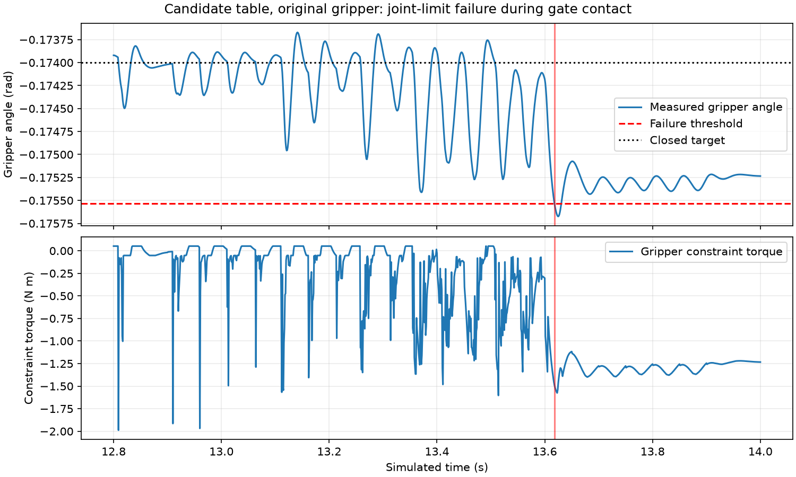

# Stable table contact and moving-contact trace checkpoint

**Table candidate: passed the tested settling and boundary checks. Complete-path readiness: not passed. RL remains off.**

## Implemented candidate

`scripts/table_candidate.py` builds `artifacts/table_candidate.xml`. A hidden plane provides the top contact surface at z=0; a non-colliding box preserves the original visible slab (x from -0.21 to 0.49 m, y from -0.30 to 0.30 m). The original gripper meshes and primitives, gate, mass, friction, solver settings and success tolerances remain intact. The candidate is opt-in in the validation/trace tools; it is not the production default.

The original task rule requires every block corner to remain within x=[0.08,0.32] m and y=[-0.14,0.14] m. That rectangle lies strictly inside the visible table. The physics-step monitor rejects excursions; an infinite plane cannot make an outside pose a valid success. This preserves finite **task boundaries**, not physical falling off the slab: the plane still supports objects outside it during diagnostic continuation. Edge-fall dynamics are outside this candidate's validated scope.

## Validation results

- Settling: **216/216** cases pass. Three positions, 24 yaw angles at 15-degree intervals, three initial tilt/height combinations. Each runs 3 seconds with frozen motor targets; every 1 ms in the last second is checked against the original 5 mm/s and 5 degrees/s thresholds and physics safety flags.
- Maximum speed in that final second: **0.000288 mm/s**, **0.000020 degrees/s**. All recorded states finite.
- Eight boundary probes: four task-boundary violations and four visible-table-edge violations. **8/8 rejected on GPU and 8/8 in native MuJoCo**, each with outside-workspace flag 4. These are synthetic boundary snapshots, not edge-crossing trajectories.
- This is a table-contact test, not a 216-episode full-task success rate. Stage 3 moves the gate away during settling, so gate contact cannot confound that test.

## Moving failures, localized at 1 ms

The trace records qpos, velocity, acceleration, generalized constraint force, motor targets, solver iterations, constraint count, safety flags, stationary-hold counter and actual GPU contact pairs/normal constraint forces. It replays the saved commands with the original controller. It deliberately continues after failure (or resets failed worlds in the reset variant) for diagnosis; continuation is not a valid demonstration.

1. **Gripper joint limit at 13.618 s**, world 1: gripper angle -0.175534159 rad; physical lower limit -0.174533000 rad; allowed rule threshold -0.175533000 rad. The target is -0.174 rad, close to the hard stop. At this instant the moving-jaw mesh presses block_0 with **37.70 N** normal constraint force and **0.293 mm** penetration while the block also contacts the north gate. This identifies a loaded/wedged contact condition, not a reason to relax the joint-limit rule.
2. **Jaw/gate collision at 21.031 s**, world 0: fixed_jaw_mesh_0 against gate_south, **0.078 mm** penetration and **12.84 N** normal constraint force. The invalid-contact tolerance remains 0.050 mm.
3. The box-table comparison also catches moving_jaw_mesh_0 against gate_north around 4.47 s. The repeated plane run reaches a jaw/gate collision rather than a valid parking finish. Different outcomes remain possible from the same nominal command sequence.

These are simulated constraint forces, not calibrated hardware force measurements. The first two reported events used 3 and 6 solver iterations, respectively, below the configured 100-iteration limit; solver-iteration exhaustion is not shown at those events.

| Instrumented run | Duration (s) | First failure times (s) | Nonfinite detected | Full-task completion before failure |
|---|---:|---|---|---|
| moving_trace_plane | 30.0 | w1: 13.618, w0: 21.031 | False | [None, None, None] |
| moving_trace_plane_repeat | 30.0 | w0: 20.983, w2: 20.983, w1: 21.031 | False | [None, None, None] |
| moving_trace_box | 30.0 | w1: 4.470, w0: 13.618, w2: 21.076 | False | [None, None, None] |
| moving_trace_plane_resets | 30.0 | w0: 13.615, w1: 21.029, w2: 21.030 | False | [None, None, None] |
| moving_trace_box_resets | 30.0 | w2: 4.472 | False | [None, None, None] |

No NaN/Inf recurred in these five instrumented, three-world runs. This does **not** resolve the intermittent failures recorded previously: added instrumentation changes execution details, and the underlying cause has not been established. Resets produced zero immediate change in the unreset worlds' qpos, qvel, motor targets and warmstart in the measured checks; that rules out direct mutation of those fields in these runs, not every possible reset/derived-state issue.

## Next checkpoint

Integrate the validated table candidate with explicit finite-task-boundary documentation, then replace the fragile gate repositioning with object-pose feedback and more clearance. Prevent sustained gate wedging and provide gripper joint-limit margin without removing gripper surfaces or weakening collision rules. Re-run native/GPU full sequences, perturbations and a repeated-reset numerical soak before RL. The intermittent NaN issue remains on that validation gate.

## Commands and GUI

```powershell
.\scripts\table-checkpoint.ps1 -Mode validate
.\scripts\table-checkpoint.ps1 -Mode trace-plane
.\scripts\table-checkpoint.ps1 -Mode trace-box
.\scripts\table-checkpoint.ps1 -Mode reset-plane
.\scripts\table-checkpoint.ps1 -Mode reset-box
.\scripts\table-checkpoint.ps1 -Mode report
.\scripts\table-checkpoint.ps1 -Mode view
```

The GUI clip shows the measured approach to the gripper-limit event and stops its recording at the first policy frame containing that failure, then loops. It is a failed diagnostic replay, not live physics or a trained policy. The viewer uses the existing scene for display; the candidate has the same visible tabletop and robot.

Evidence: `table_candidate_validation.json`, `moving_trace_*.json`, full millisecond state arrays and final contact-history chunks in `moving_trace_*_detail.npz`. Contacts at first failures are included directly in JSON. The detailed tensor field layout is defined by `state_record` in the tracer. Reports retain their run-source hashes; optional reset tracing was added after the initial no-reset runs. `table_checkpoint_manifest.json` hashes the current scripts, inputs and reports.


